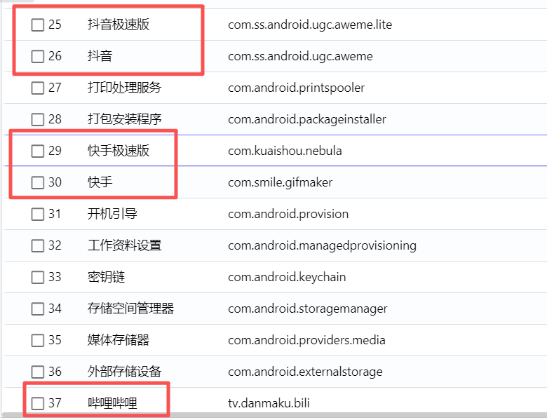
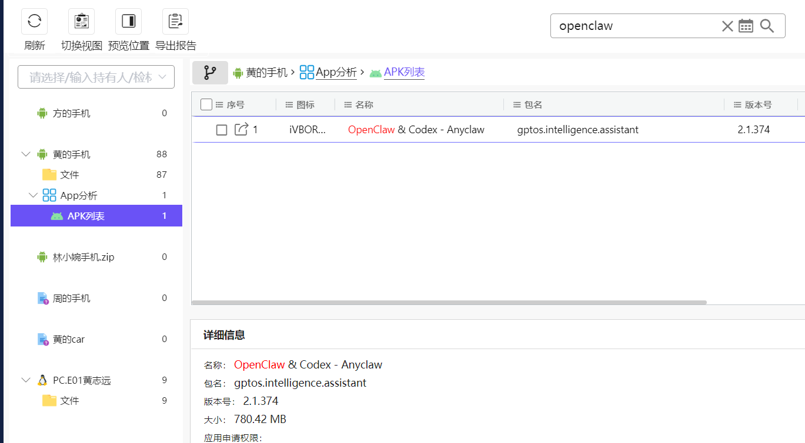

## 1. 分析黄志远phone.E01检材，黄志远手机总共安装了多少款短视频应用？
答案：`4`

这里就很抽象，哔哩哔哩不算短视频，感觉题目有点问题

## 2. 分析黄志远phone.E01检材，黄志远手机安装的龙虾应用的包名是什么？
答案：`gptos.intelligence.assistant`
搜openclaw能搜出包名

## 3. 接上题，首次打开应用的时间是？（错）
答案：`2026-04-17-11:53:18`

解析：在 `C:\hlnet\2-1778389023\phone.E01\分区3\data\gptos.intelligence.assistant\shared_prefs\com.google.android.gms.measurement.prefs.xml` 中存在 `first_open_time=1776397998058`，换算后得到该时间。

## 4. 分析黄志远phone.E01检材，黄志远使用此应用攻击过多少台主机？（错）

答案：`0`

解析：在 `gptos.intelligence.assistant` 的私有目录中检查了 `.ssh`、`.codex`、`.openclaw`、`WebView`、`datastore`、日志等位置，未见明确目标主机、连接记录、`known_hosts` 或攻击命令留痕，因此按现有证据记为 0。

  

## 5. 分析黄志远phone.E01检材，黄志远使用哪款应用控制了其PC的agent工具？
    

答案：`discord`

解析：`com.discord` 的本地消息存储中存在与 agent 相关的配对码、控制指令和回传结果，能够直接证明其被用于控制 PC 端 agent。

  

## 6. 分析黄志远phone.E01检材，黄志远使用这款应用的版本是多少？（错）
> 后面想感觉是格式错了，应该是311.2

答案：`311.20`

解析：在 `C:\hlnet\2-1778389023\phone.E01\分区3\data\com.discord\shared_prefs\BundleUpdater.xml` 中可见 `ota_version=311.20`，对应应用版本。

  

## 7. 分析黄志远phone.E01检材，接上题，登录的用户名是什么？
    

## 8. 分析黄志远phone.E01检材，该应用与pc端agent的配对码是什么？（错）
    

答案：`HNZ6UFW6`

解析：在 `C:\hlnet\2-1778389023\phone.E01\分区3\data\com.discord\files\kv-storage\@account.1457974771206852664\a-wal` 的私聊消息中可见 `Here's your pairing code: HNZ6UFW6`。

  

## 9. 分析黄志远phone.E01检材，该应用共对几个ip进行扫描？（错）
    

答案：`2`

解析：在 Discord 消息记录中可确认实际被下达扫描/探测指令的目标 IP 为 `192.168.1.16` 和 `192.168.61.135`，因此共 2 个。

  

## 10. 分析黄志远phone.E01检材，该应用总共调用了几个暴力破解工具？（错）
    

答案：`1`

解析：命令回传记录中明确出现过的暴力破解工具只有 `hydra`。虽然调用了不止一次，但工具种类只算 1 个。

  

## 11. 分析黄志远phone.E01检材，黄志远使用其内部通联工具进行沟通，其账号的登陆密码是多少？
    

答案：

  

## 12. 分析黄志远phone.E01检材，黄志远一共发送过几个文件给代号军师的嫌疑人？（猜）
    

答案：2

猜的

  

## 13. 分析方俊朗phone.E01检材，方俊郎手机总共安装了多少款理财应用？（错）
    

**答案：** `3` 
**解析：** 应用列表中“股票网银/理财类”非系统应用有：股参谋、京东金融、东方财富，共 3 款。

  

## 14. 分析方俊朗phone.E01检材，方俊朗使用筛选优质客户的应用包名是什么？
    

**答案：** `com.example.predictor` 
**解析：** 应用列表中存在可疑自装应用，包名为 `com.example.predictor`，名称为空，结合“筛选优质客户/预测器”语义判断对应此应用。
