## 计算机取证
计算机取证-1简答分值 10计算机取证

1.请找出操作系统主机名。
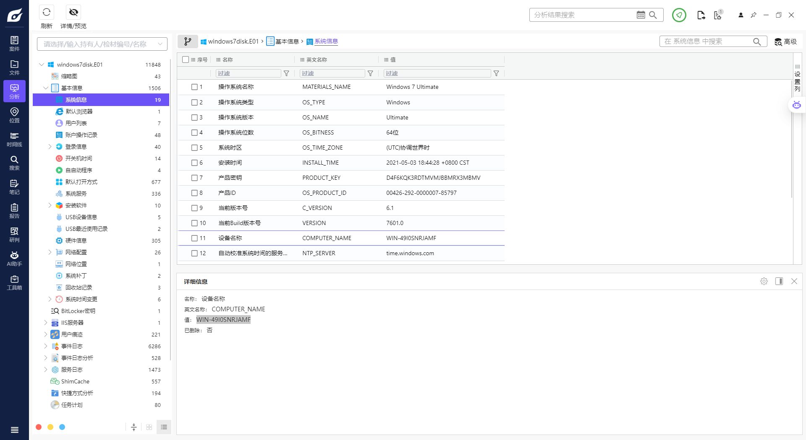


计算机取证-2简答分值 10计算机取证

2.请给出源磁盘的SHA256哈希值。

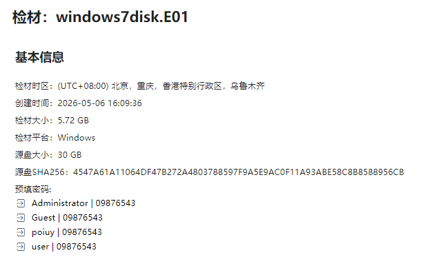

计算机取证-3简答分值 10计算机取证

3.请找出操作系统中安装的Android模拟器名称和安装日期。（格式：雷电模拟器2025年06月26日）
noxplayer夜神模拟器
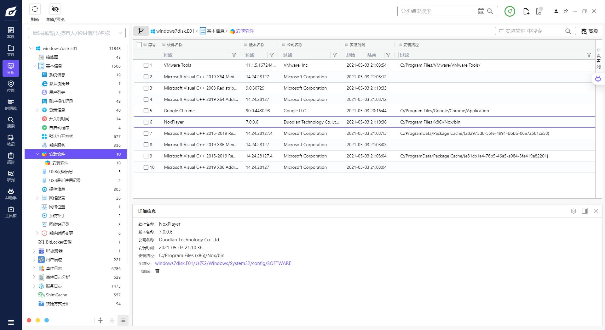
55个用户已解出

计算机取证-4简答分值 10计算机取证

4.请找出使用Bitlocker加密的虚拟磁盘文件。（格式：xxx.xx/xxxx.xx）
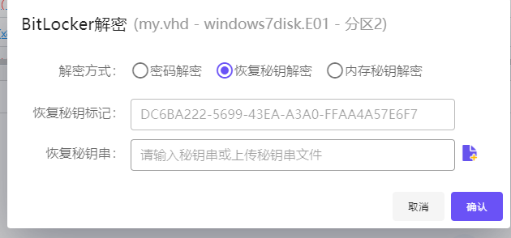
31个用户已解出

计算机取证-5简答分值 10计算机取证

5.请找出操作系统安装日期。

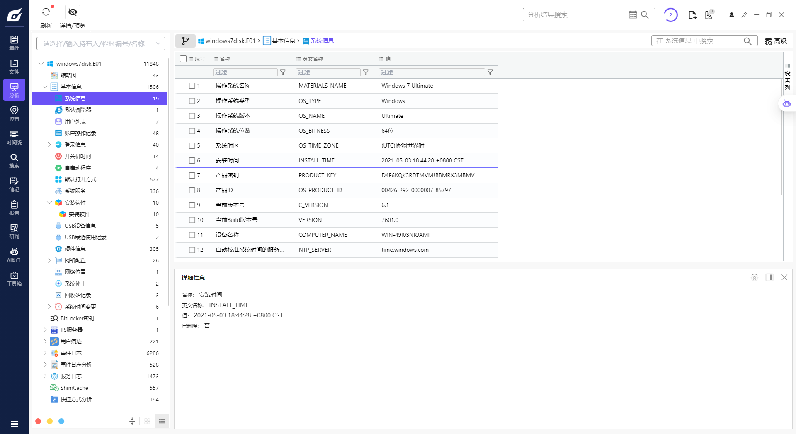

计算机取证-6简答分值 10计算机取证

6.请找出操作系统最后登录的用户。

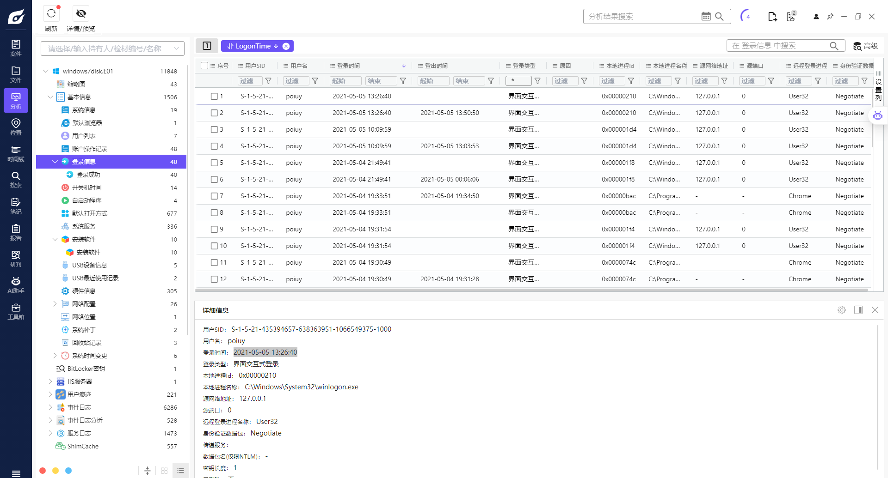

计算机取证-7简答分值 10计算机取证

7.请找出操作系统中安装的浏览器最后浏览过的网站域名 [格式： www.baidu.com]

passport.baidu.com
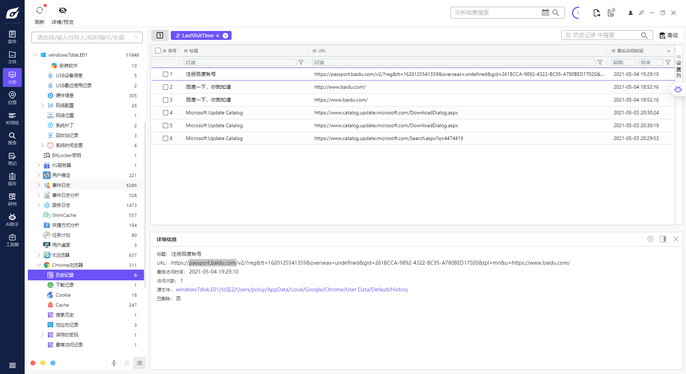
计算机取证-8单选分值 10计算机取证

8.请找出操作系统中安装的浏览器名称的对应的安装日期。

A.360浏览器2021-05-03 20:16:43

B.Edge浏览器2021-05-03 20:26:44

C.谷歌浏览器2021-05-03 20:16:44

D.搜狗极速浏览器2021-06-03 20:16:44

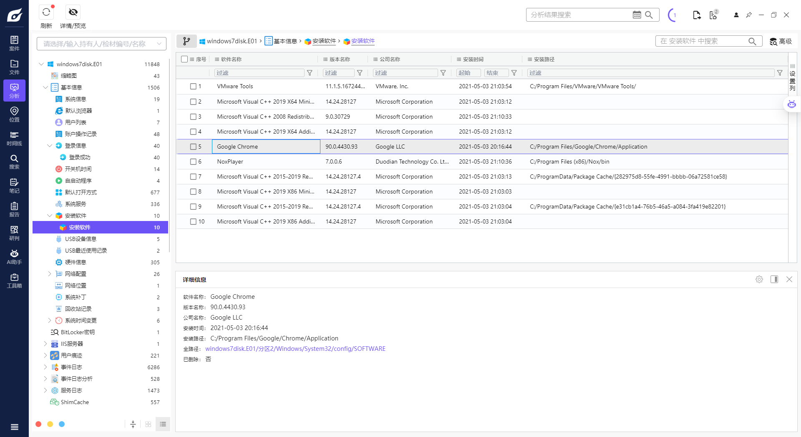

计算机取证-9简答分值 10计算机取证

9.请找出操作系统版本号。

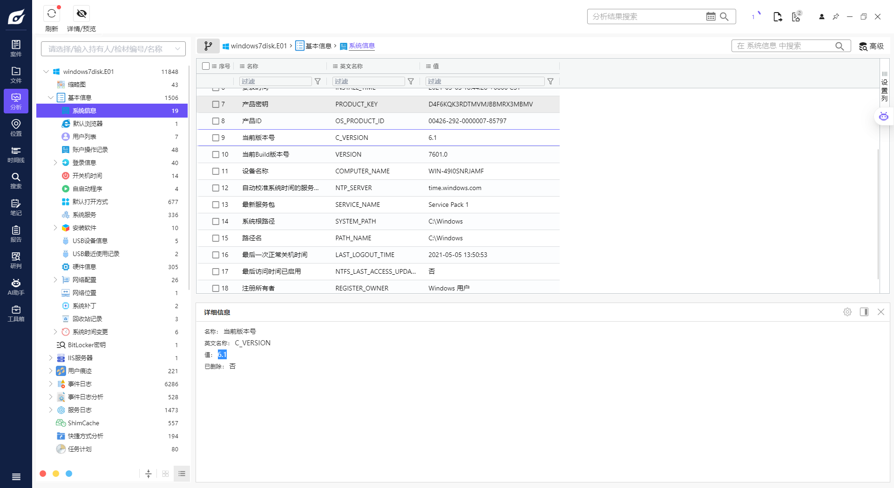

计算机取证-10简答分值 10计算机取证

10.请找出操作系统设置的时区名称。（格式：UTC+2）
UTC+0
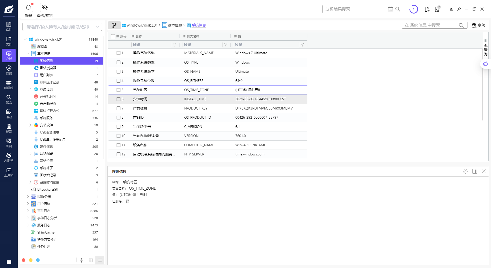

计算机取证-11简答分值 10计算机取证

11.请找出操作系统中安装的浏览器“自动填充”中保存的网站密码信息（网站+用户名+密码）

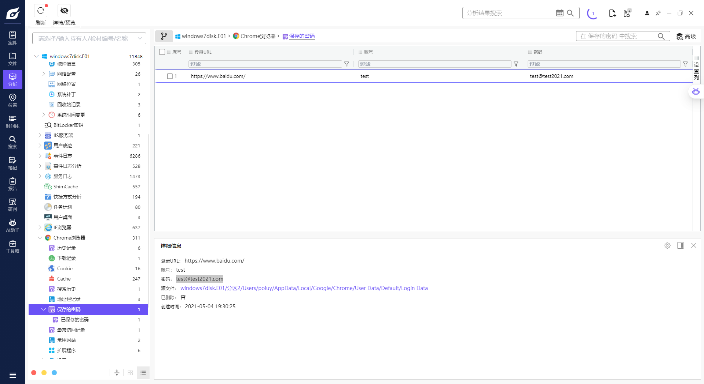

计算机取证-12简答分值 10计算机取证

12.请找出用户“poiuy”的SID。

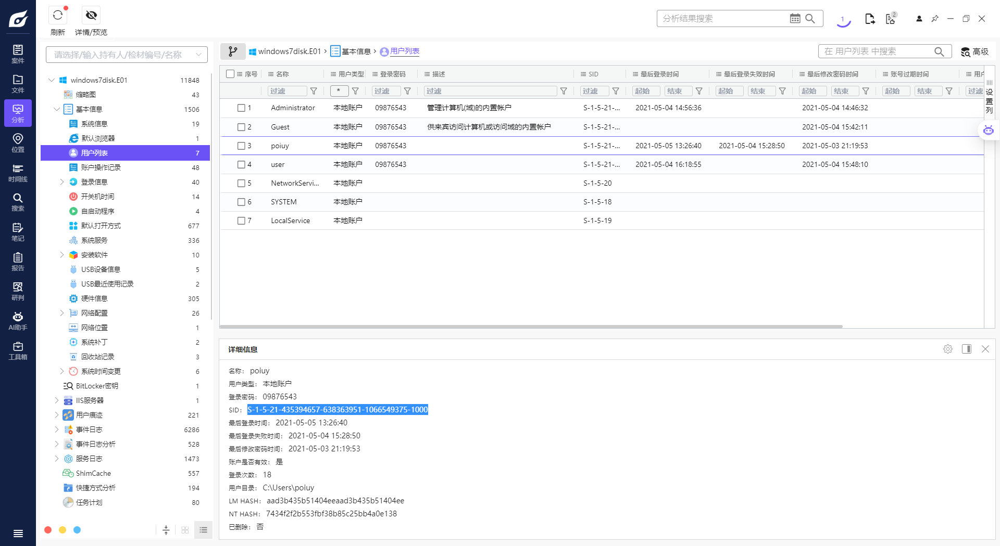

计算机取证-13简答分值 10计算机取证

13.请给出源磁盘的大小（字节）。（提示：一个扇区=512）

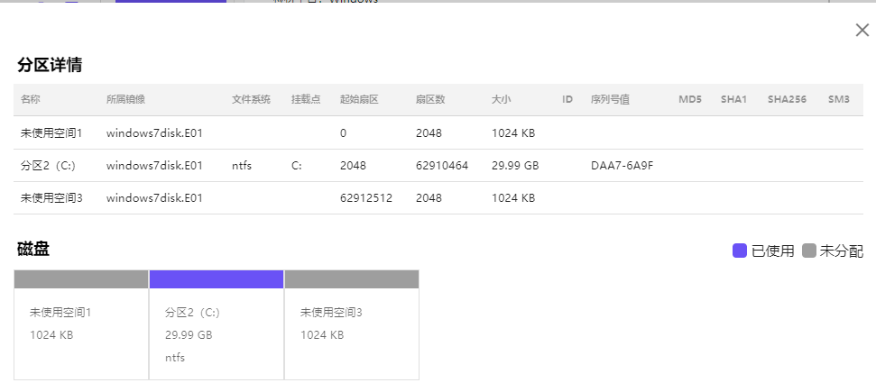
62914560 × 512 = 32212254720
计算机取证-14简答分值 10计算机取证

14.请找出各分区文件系统类型。

ntfs

计算机取证-15简答分值 10计算机取证

15.请找出曾经连接到该系统的U盘的品牌、序列号、最后插拔日期。 （格式：xx+xx+2024-03-12）

SanDisk+4C530001310423109141+2021-05-04
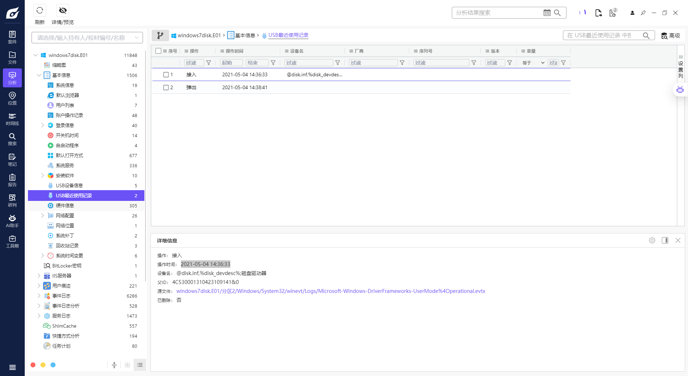
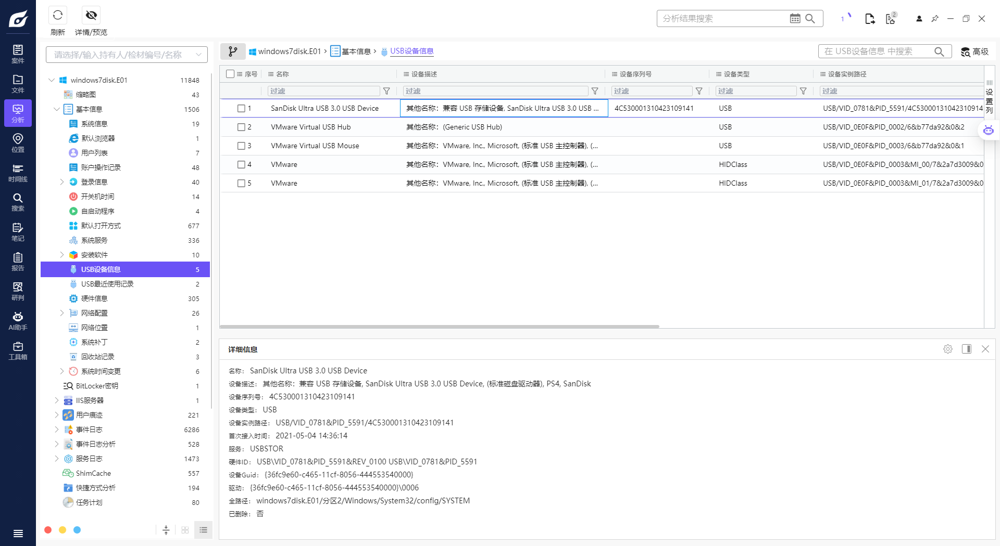
计算机取证-16简答分值 10计算机取证

16.请找出回收站中的文件的名称（格式：2333.exe+1.txt+3.E01）

nox_setup_v7.0.0.6_full.exe+新建文本文档1.txt+测试.rtf
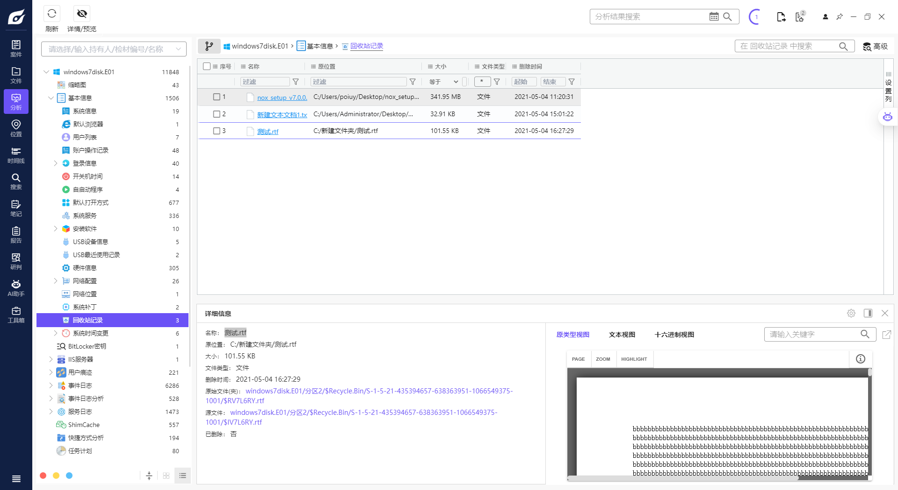
计算机取证-17简答分值 10计算机取证

17.请找出使用Bitlocker加密的虚拟磁盘文件恢复密钥文件名是什么。

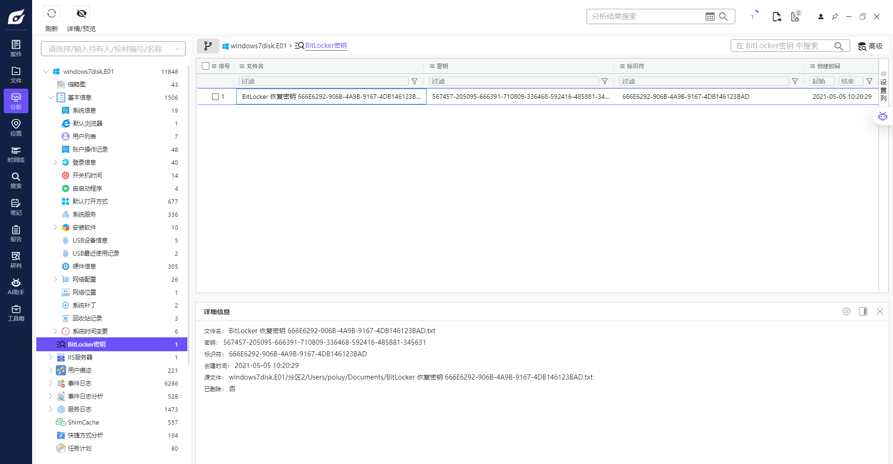

计算机取证-18简答分值 10计算机取证

18.请找出用户“poiuy”的登录密码。
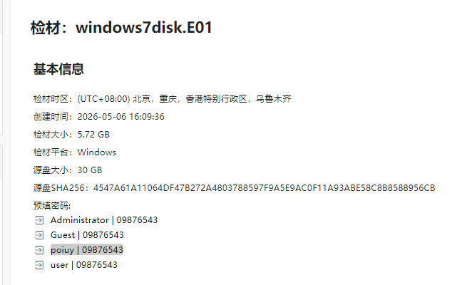
## 内存取证
内存取证-1简答分值 10内存取证
请给出计算机内存创建北京时间？ [答案格式：2000-01-11 00:00:00]
注意这里要+8（北京时间）
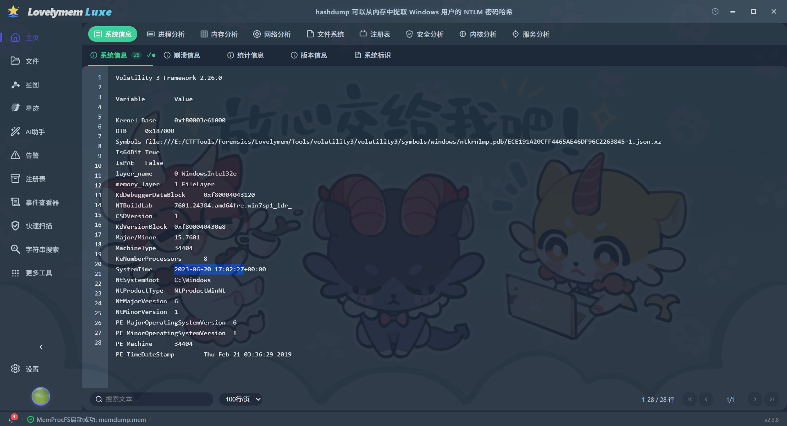
内存取证-2简答分值 10内存取证
请给出计算机内用户yang88的开机密码？ [答案格式：abc.123]
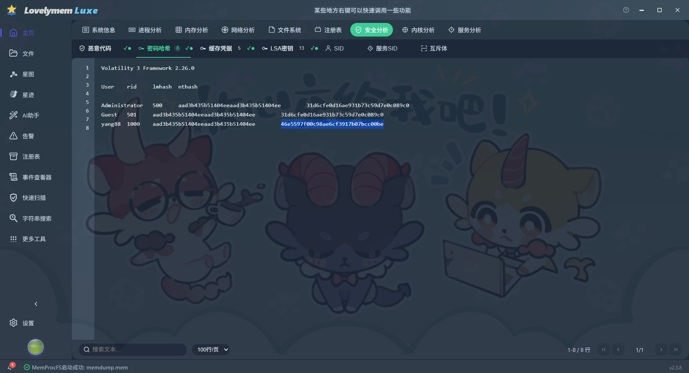
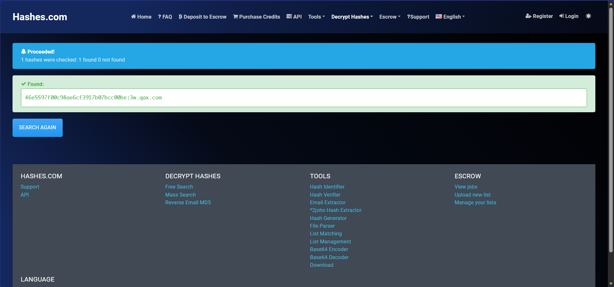
内存取证-3简答分值 10内存取证
提取内存镜像中的USB设备信息，给出该USB设备的最后连接北京时间？ [答案格式：2000-01-11 00:00:00]
这里真正像外接 U 盘的设备是：

```
VID_0781&PID_558CSerial Number: 32313131374D343032343132[2023-06-20 17:01:25 UTC]
```

其中：

```
VID_0781
```

通常对应 **SanDisk 闪迪设备**，`PID_558C` 是该 USB 设备的产品 ID。前面的 `ROOT_HUB`、`ROOT_HUB20`、`VID_0E0F` 更像是 USB 控制器、虚拟机相关设备，不是题目要找的外接 USB 存储设备。
所以最后连接时间取：2023-06-20 17:01:25 UTC
13个用户已解出
内存取证-4简答分值 10内存取证
请给出用户yang88的LMHASH值？ [答案格式：字母小写]
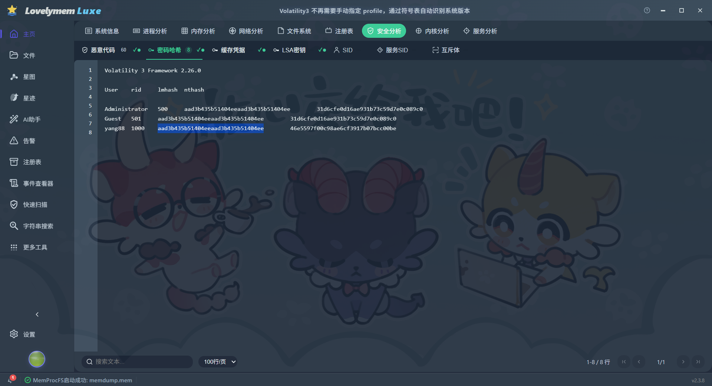
27个用户已解出
内存取证-5简答分值 10内存取证
请给出用户yang88访问过文件“提现记录.xlsx”的北京时间？ [答案格式：2000-01-11 00:00:00]
et.exe应该是create时作为访问
但是输进去不对
2023-06-21 00:58:31
14个用户已解出
内存取证-6简答分值 10内存取证
请给出“VeraCrypt”最后一次执行的北京时间？ [答案格式：2000-01-11 00:00:00]

23个用户已解出
内存取证-7简答分值 10内存取证
分析内存镜像，请给出用户在“2023-06-20 16:56:57 UTC+0”访问过“维斯塔斯”后台多少 次？[答案格式:10]
2
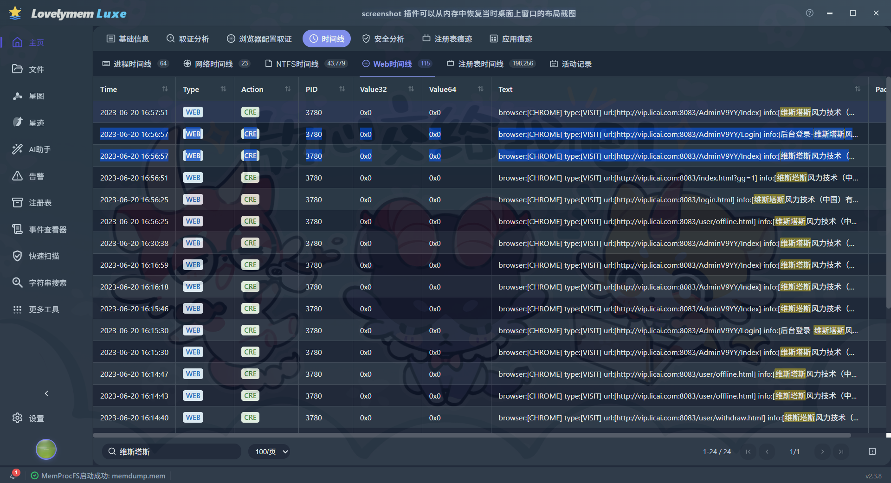
16个用户已解出
内存取证-8简答分值 10内存取证
请给出用户最后一次访问chrome浏览器的进程PID？ [答案格式：1234]
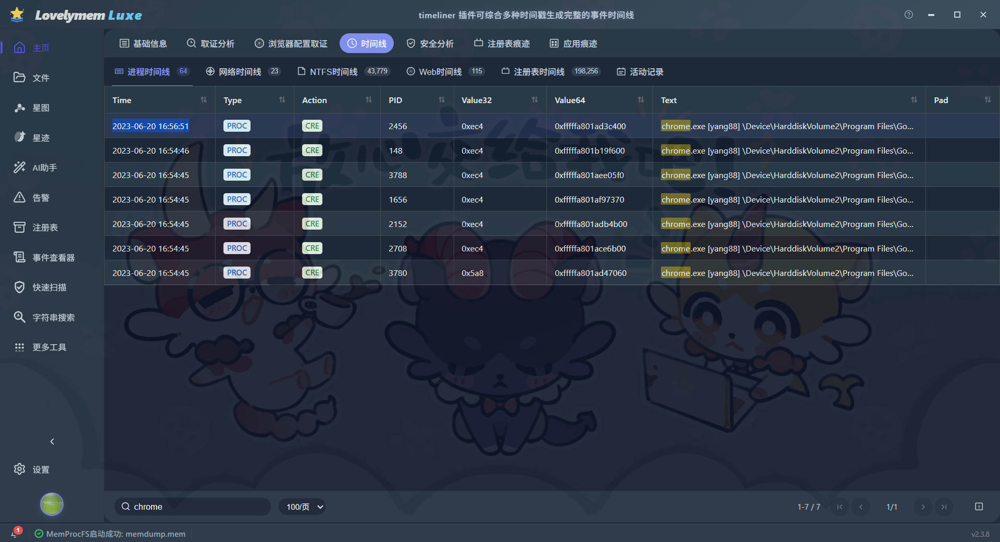