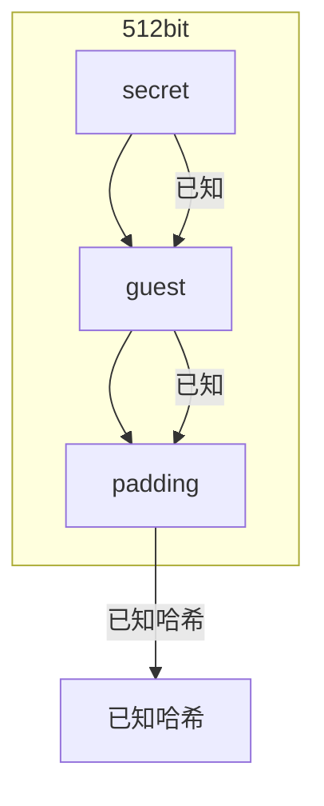
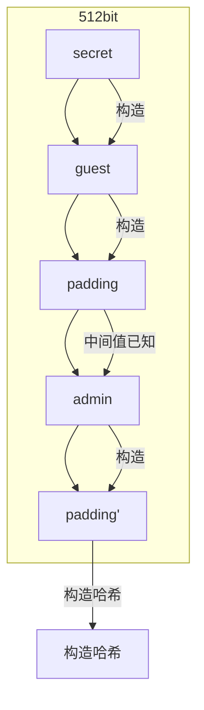
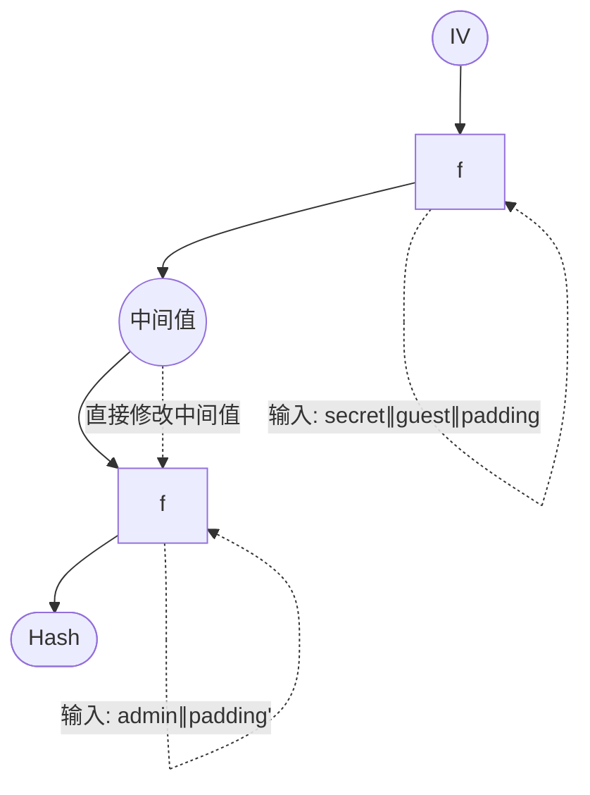

## 离散对数
公钥密码常常会基于一些难以解决的数学难题来构建公钥密码算法,常用的两个数学难题:
- 大整数因数分解难题(RSA算法)
- 离散对数难题(Diffie-Hellman算法)
想要理解离散对数难题,就需要先了解“群论”相关的数学基础知识。

### 集合
集合简单来说就是把一堆东西(元素)放在一起，但是这样用处并不大,东西之间需要相互作用(操作/运算)才能更好地描述世界:

集合自然数N是一个集合,从自然数N这个集合出发,通过运算就可以创造越来越大的集合:

运算不止加减乘除,数学到后面就多了很多“抽象运算”,从而不断地扩充数集。其中,有种特殊的集合+运算就是群(group)。
简单来说,群的作用就是描述对称(系统从一个状态变换到另一个状态,如果这两个状态等价,则说系统对这一变换是对称的)。
再来看多项式,多项式的根也是对称的。一元二次方程的两个根具有如下性质:
可见,相对于+x运算,多项式的根互换之后结果仍然不变,针对这两个运算它们是对称的。
通过数学化的方法,来形式化定义对称。 
### 群
群只关心对称最本质、最抽象的性质,所以只关心操作,只需把操作放到集合里。
群是一个集合G,连同一个运算”·”,这个运算结合任何在集合G中的两个元素a和b,并形成另外一个也在群中的元素a ·b=c。
这个集合和运算(G,·)必须满足群公理的4个条件:
- 封闭性:对于所有G中的a,b,运算a·b的结果也在G中
- 结合性:对于所有G中的a,b和c,都满足(a·b)·c=a·(b· c)
- 单位元:G中存在一个元素e,对于所有G中的元素a,都有e·a=a · e =a
- 逆元:对于G中的每一个元素a,G中都存在一个元素b满足a·b=b·a=e,即a^-1=b
对于正方形(G,+) = ({0,r,2r,3r},+)的这个例子:
集合里的元素:所有保证对称性的操作
- 二元运算:模4加法
- 封闭性:旋转组合的结果还是在集合内
- 结合性:不管哪个操作先进行,旋转后的结果都是一样的
- 单位元:保持不动就是单位元,映射为0
- 逆元:旋转正方形是可逆的,而且这也是一个循环操作,旋转90度和旋转270度互为逆元。
模p的乘法运算,也可以组成一个群,定义为:(Zp*,)=({1,2,3, ... ,p-1},)
- 集合里的元素:所有小于p的正整数
- 二元运算:模p乘法
- 封闭性:两个元素相乘,结果模p,仍然为小于p的正整数
- 结合性:乘法本身具有结核性
- 单位元:乘上1,元素保持不变,因此1就是单位元
- 逆元:根据扩展欧几里得定理,对于每一个元素a,都存在整数x和y使得ax+py=1,即ax=1(mod p),每个元素都存在逆元
### 群的特性
群G的阶数定义为:群中所有元素的个数,即|G|。
例如:
正方形群(G,+)= ({0,r,2r,3r},+)中,群的阶数|G|= 4
(Zp,)= ({1, 2,3,…,p-1},·)中,群的阶数|G|=p-1
群中某个元素a的阶数定义为,能使得下式成立的最小整数k:

元素的阶数记做ord(a),从而有ord(a)=k。
例如,对于Z\*11中的元素a=2来说,依次计算a的幂次:
a =2
a^2 = 4
a3 = 8
a4 = 5 mod 11
a5 = 10 mod 11
a6 = 9 mod 11
a7 = 7 mod 11
a8 = 3 mod 11
a9 = 6 mod 11
a10 = 1 mod 11
从而得到元素a= 2 的阶数为ord(2) = 10。
 有些元素的阶数比较小(例如3的阶数就只有5),而有些元素的阶数比较大(例如2的阶数就有2)。
最大的阶数为群的阶数,我们将阶数能够达到最大的元素(即阶数为群的阶数)称为生成元(generator)或者原根(primitive element),一般记做g。
通过这些原根,计算其幂次,即可生成整个群里的所有元素。
例如对于Z\*11中的原根g=2来说,有

群$Z_p^*$中，若有一个原根$g$，则可以很容易地计算这个群中的任何一个元素： $a \equiv g^k \pmod{p}$ 给定$Z_p^*$和原根$g$，想要求对数 $k = \log_g a \pmod{p}$ 却是很困难的，这就是$Z_p^*$中的**离散对数难题**。
例如,在群Z17627中,已知生成元g=6,其幂次的结果是非常离散的,没有任何规律可循,如下图所示:

在密码学的实际应用中,一般常用1024、2048、3072bit的模数,其离散对数的难度是很大。
现有的最好的通用型解决离散对数问题的算法,其算法复杂度也要√n级别。
- Baby step giant step算法
- Pollard's rho算法
- Pohlig-Hellman算法
- Index calculus算法
SageMath中的内置discrete_log默认会调用baby step giant step算法和Pohlig-Hellman算法来求解离散对数问题,数据量较小的时候可以很快求解出来。
```python
sage :g = Mod(2,37)
sage :a = g^20
sage: discrete_log(a, g)
20
```

## DH密钥交换协议
Alice和Bob必须先进行密钥协商,双方共享一份密钥后,才能使用共享密钥来进行后续的加密通讯。
通常的密钥交换都是通过一些成本比较高昂的“安全信道”来实现的。

Diffie-Hellman密钥交换协议要解决的问题就是:如何在不安全信道中安全地交换密钥。
这样就可以不再需要借助成本“高昂”的安全信道。

### Diffie-Hellman密钥交换协议：
1. 首先通信双方Alice和Bob先共享两个公共参数，模数\( p \)和\( Z_p^* \)中的一个原根\( g \)。  
2. Alice本地随机生成一个私钥\( a \)，并计算公钥\( A = g^a \)，发送\( A \)给Bob  
3. Bob在收到\( A \)后，也本地随机生成一个私钥\( b \)，并计算公钥\( B = g^b \)，发送\( B \)给Alice；此外，Bob还可以计算共享密钥\( k = A^b = g^{ab} \)  
4. Alice收到Bob发过来的\( B \)后，也可以计算共享密钥\( k = B^a = g^{ab} \)  
5. 至此，密钥交换结束，双方都可以得到一份共享密钥  

从对手Eve的视角来看,Eve只能看到在传输过程中的两个公钥A、B,以及两个公共参数p、g。
如果Eve要破解这个协议,即获取共享密钥k,就必须能从这4个数据中计算出任意一个私钥a或b。

Eve有如下3种利用路径：
6. 计算私钥\( a \)：Eve获取到的有用信息只有\( A \)、\( p \)、\( g \)和\( A \equiv g^a \pmod{p} \)，想要计算出\( a \)，就是要解决离散对数难题，这是很难的。
7. 计算私钥\( b \)：Eve获取到的有用信息只有\( B \)、\( p \)、\( g \)和\( B \equiv g^b \pmod{p} \)，想要计算出\( b \)，同样也是要解决离散对数难题，很难。 
8. 计算共享密钥\( k \)：已知\( A \equiv g^a \pmod{p} \)和\( B \equiv g^b \pmod{p} \)，直接计算\( k \equiv g^{ab} \pmod{p} \)，这在密码学中被称为“DH难题”，其难度被证明是不亚于离散对数难题的。 

因此，DH密钥交换协议的安全性是基于离散对数难题的安全性。
### 中间人
1. Alice发送完A后,Eve从中进行拦截,并且阻断Alice发送给Bob的信息。与此同时,Eve在本地生成一个虚假的私钥c,并计算虚假的公钥C=gC,分别发送给Alice和Bob,假装自己分别是Bob和Alice。

2. 随后，Eve会接收到Bob发回来的Bob公钥B,Eve同样地对其进行拦截,并阻断Bob发送给Alice的信息。

   3. 此时Eve可以计算出两个共享密钥，分别是与Alice的\( $k_a = A^c = g^{ac}$ \)和与Bob的\( $k_b = g^{bc}$ \)，并使用这两个共享密钥分别声称自己是Bob与Alice通信、声称自己是Alice与Bob通信。  
   这样Eve就成为了一个中间人，代理转发Alice和Bob之间的通讯，并且可以看到原始通讯内容，成功破解DH密钥交换协议。  

例题：
题目背景:Alice和Bob共有一半的flag,他们想通过DH密钥交换来共享一个密钥,从而建立一个安全的加密通讯信道,来交换他们的flag。


此时共享密钥已经建立,开始加密通讯阶段。Bob首先向Alice发送了他加密的flag。从中,我们可以解出明文的flag,并且重新用和Alice的共享密钥转发给Alice。
```python
C_b = ...
m_b = inverse(k_b, p) * C_b % p
# 解密Bob发来的flag
# b'-1n~ThE+miDd!3_4TtAck~}'

C_a = m_b * k_a % p
print(C_a)#转发给Alice

print(long_to_bytes(m_b))
```
此时从Alice发来的消息中,我们同样可以用和Alice的共享密钥
解出Alice的flag,从而得到整个flag
```python
C_aa =
m_a = inverse(k_a, p) * C_aa % p
print(long_to_bytes(m_a))
```
## 公钥密码-数字签名
### 数字签名
在现实世界中,经常会用到签名,比如说签合同、协议等等。
签名可以表示自己同意、认可、确认、授权。
例如,在合同中,签名代表着同意,并且也会产生法律效力,不可抵赖。

在网络空间中,其实也有签名,这种签名叫做数字签名(Digital Signature)。
数字签名一般都是基于非对称密码加密算法来实现的,非对称密码算法的解密运算即为签名,加密运
算即为验签。
假设Bob想要对一份文档m进行签名,Bob会使用他的私钥对文档进行签名运算,并得到签名sig。
随后,Bob可以将文档m和签名sig发送给Alice,Alice使用Bob的公钥即可对签名sig进行验证。
数字签名的几个要点:
- 签名的消息m不一定要加密,可以明文形式传输给Alice。
- 只有签名者拥有私钥,能够对消息进行签名,任何其他人由于没有Bob的私钥,因此无法签名。
- 任何人都拥有公钥,可以对签名进行验证。
- 消息完整性:如果消息在传输过程中被篡改,则可以通过检查签名察觉出来。
- 不可抵赖性:因为只有Bob有私钥可以签名,因此如果有签名,则说明Bob肯定对其进行了签名运算,Bob不可抵赖这一事实。
RSA加密算法不仅仅可以用来对数据进行加密,也可以被用来做数字签名。不同的是,加密是使用公钥加密,解密是使用私钥解密;而签名则是使用私钥来签名,验签是使用公钥验签。
RSA的公私钥:
- 私钥:$k_{pri}=(d)$
- 公钥:$k_{pub}=(e,n)$
签名过程：

### Elgamal数字签名
Elgamal数字签名算法是一种基于模运算和离散对数难题的数字签名算法,于1985年被Elgamal
发明。
Elgamal主要分为以下3个部分:
1. 密钥生成
2. 签名构造
3. 验证签名
Elgamal算法参数：  
- \( p \)：一个很大的素数，一般1024位  
- \( g \)：\( $Z_p^*$ \)中的一个原根  
- \( x \)：私钥，一个随机生成的整数，其值满足 \( 0 < x < p \)  
- \( y \)：公钥，通过 \( $y \equiv g^x \pmod{p}$ \) 计算得出  
最终消息m的签名即为（r，s）
Elgamal验签过程：  
1. 计算 \( $v = y^r \cdot r^s \pmod{p}$ \)  
2. 若 \( $v = g^m$ \)，则签名正确，否则签名有误。  
正确性验证：  
$$\begin{align*}
v &= g^{xr} \cdot g^{ks} \\
&= g^{xr} \cdot g^{m - xr} \\
&= g^m
\end{align*}$$
在Elgamal数字签名算法中,临时的随机数k的生成很关键,可以使得每一次签名值都不一样,为签名过程提供了随机性。
但如果有两次签名公用了同一份k会怎么样呢?

实际上,当k被公用了,那么对手就可以很容易地将签名私钥计算出来,即**k共享**。
由于$r \equiv g^k mod p$,对手可以根据是否有两对签名的r是一样的,来判断k是否被重复使用。
当有两次签名使用了同一份\( k \)，那么则会有以下两个式子：  
$$
\begin{align*}
s_1 &\equiv (m_1 - x \cdot r) \cdot k^{-1} \\
s_2 &\equiv (m_2 - x \cdot r) \cdot k^{-1} \\
\end{align*}
$$
两边同时乘以\( k \)，可以转化为  
$$
\begin{align*}
s_1 \cdot k &\equiv m_1 - x \cdot r \\
s_2 \cdot k &\equiv m_2 - x \cdot r \\
\end{align*}
$$
两式相减消去\( $x \cdot r$ \)，可得  
$$
\begin{align*}
s_1 \cdot k - s_2 \cdot k &\equiv m_1 - m_2 \\
k &\equiv (m_1 - m_2) \cdot (s_1 - s_2)^{-1} \\
\end{align*}
$$  恢复出\( k \)后，就可以根据任意一个式子来计算私钥\( x \)：  
$$
\begin{align*}
s_1 \cdot k &\equiv m_1 - x \cdot r \\
x &\equiv (-s_1 \cdot k + m_1) \cdot r^{-1} \\
\end{align*}
$$
代码实现：
```python
from Crypto.Util.number import inverse

p = ...
g = ...

m1 = ...
m2 = ...
(r1, s1) = (..., ...)
(r2, s2) = (..., ...)

k = (m1 - m2) * inverse(s1 - s2, p) % p
x = (-s1 * k + m1) * inverse(r1, p) % p  
```
## 哈希函数
设想一下如何对一段很长的消息进行数字签名?
一般RSA的位数都只有1024~3072bit,如果要对GB级别的数据量进行签名,一个最简单的方法就是
使用分组的方式,将数据分成若干份,每一份都是RSA模数的大小,然后对每一份分别进行签名。

这种方式存在如下几个问题:
1. 需要很大的计算量:签名运算本来就很慢,又要进行几百万次签名运算,这计算负载的是极大的负担。
2. 签名的数据量也很大:GB级别的数据,其签名的数据量也有GB级别,不易传输。
3. 安全问题:对手可以任意调换消息和签名的顺序,导致一些严重的安全问题。
一个好的解决方案是,先通过哈希函数,将长段的消息压缩为一个摘要值,再对这个摘要值进
行签名运算。

流程：

哈希函数(Hash Function),能够将任意长度的输入转变为固定长度的输出值(散列值/摘要值)。
哈希函数(Hash Function)一般具有如下特征:
- 接受任意长度输入:SHA1最高接受2^64bit的输入
- 产生固定长度的输出:SHA1输出160bit的摘要值
- 高效性:哈希函数的计算时间不宜过长,需要较快地计算出结果
- 单向性:已知哈希函数的输出y=H(x),无法反向求出输入x
- 抗碰撞性:很难找到两个不同的输入m1,m2,使得其H(m1) == H(m2)是一样的
- 雪崩效应:即使只改变输入值的一个比特位,其输出也会发生巨大改变

哈希函数除了用于数字签名,还有很多其他的用途:
- 散列表:方便数据的查询、搜索,可以达到O(1)的时间复杂度
- 错误校正:可以通过检查散列值,来用于判断传输的信息是否在中途被篡改
- 区块链:可被用作工作量证明,使用散列值来链接区块
SHA1(Secure Hash Algorithm 1,安全散列算法1)是一种密码散列函数,美国国家安全局设计,并由美国国家标准技术研究所(NIST)于1995年发布为联邦标准。
SHA1函数可以接受任意长度的输入(最大2^64bit),并生成一个160bit的摘要值作为输出。

SHA1算法采用Merkle-Damgard结构,将输入分成若干个512bit的消息块,并逐一将这些消息块经过压缩函数做运算,最后将结果输出。
由于SHA1的输入不一定是512bit的整数倍,所以需要采用填充方案对其进行填充。
首先将前面的输入分成512bit长的分组,记下整个消息一共有l位。然后,在最后一组的右侧补充一个比特1,再补充k个比特0,最后补上长度的64bit二进制表示。
压缩函数具体步骤:
1. 初始化链接状态为固定的初始值
2. 将输入的512bit消息块扩散为80个字
3. 每20个字会经过一个20轮的运算,每一轮运算都会更新链接状态
4. 80轮运算后,链接状态经过变换后输出,作为下一次压缩函数的输入。

代码实现：

Python内置库hashlib中自带sha1函数的实现,可以通过以下方法来进行调用:
```python
from hashlib import sha1
sha1(b"Hello World!").hexdigest()
```
在某些登陆场景中,服务器会通过哈希函数来进行权限认证。
合法用户应当知道$secret的具体值,从而可以计算出正确的散列值,通过校验进行登陆。

哈希长度扩展利用:当已知Hash(m),但未知m的情况下,能够推算出Hash(m || padding ||m')
当我们初次登陆时,服务器会设置cookie为md5(secret||"guest"),并将摘要值以cooki的形式发送给我
们。
借助哈希长度扩展利用,我们能够推算出md5(secret || "guest" || padding || "admin")
设置username为"guest" || padding |"admin",其中带有"admin"字样,就可以登陆获取flag。

当前我们已知的为下面这段哈希摘要值`md5(secret || "guest" || padding)`：  



我们可以构造如下`username`（橙色部分），对于这样的`username`，服务端会计算`md5(secret || "guest" || padding || "admin" || padding')`。  



其中前512bit的中间值（链接向量）是已知的，即为`md5(secret || "guest" || padding)`，利用这个已知的第一段链接向量，就可以继续去计算第二段的哈希。  

具体如何计算这样的摘要值？  

通过修改md5哈希函数算法，将第一次压缩函数\( f \)的输出结果修改为已知的中间值，然后跳过第一轮压缩，直接进行第二轮的压缩函数，即可求出\( \text{md5(secret} \parallel \text{"guest"} \parallel \text{padding} \parallel \text{"admin"} \parallel \text{padding')} \)。  



利用构造的摘要值登录  
得到构造的哈希摘要值后，设置其为`cookie`，并设置登录请求中的`username`参数为：  

```plaintext
guest\x80\x00\x00\x00\x00\x00\x00\x00\x00\x00\x00\x00\x00\x00\x00\x00\x00\x00\x00\x00\x00\x00\x00\x00\x00\x00\x00\x00\xD0\x00\x00\x00\x00\x00\x00\x00admin
```  

就能够通过登录校验，以`admin`管理员的身份登陆，获取到`flag`。  
哈希函数扩展利用的工具:
- Hashpump : https://github.com/bwall/HashPump
- hash_extender : https://github.com/bwall/HashPump
- Md5-extension-attack :https://github.com/JoyChou93/md5-extension-attack
